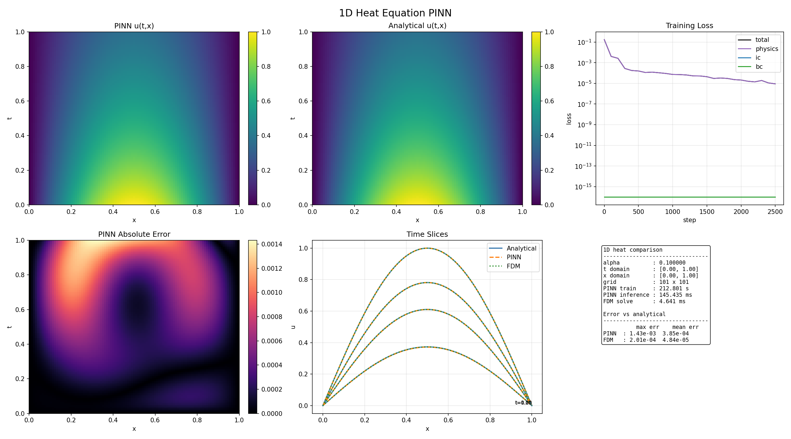
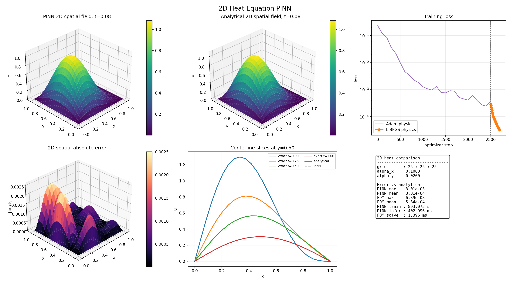
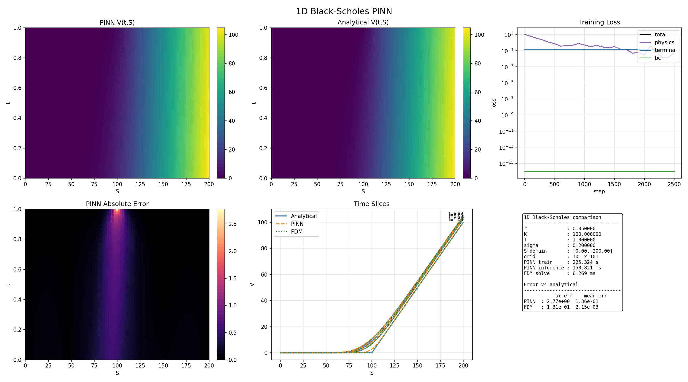

# C/CUDA Physics-Informed Neural Networks

A from-scratch Physics-Informed Neural Network framework written in C, with
CPU/OpenBLAS/OpenMP execution and an optional CUDA backend. The repository
contains the tensor and automatic-differentiation framework, PINN training
utilities, equation-specific research projects, tests, benchmarks, model
serialization, and a deployable parametric surrogate for the 1D heat equation.

This repository is focused specifically on the C/CUDA framework. The classical
and quantum harmonic-motion studies live in `Systematic-PINNs`, while the
Wright-Fisher prediction-market work lives in
`Wright-Fisher-Prediction-Markets`.

## Project tree

```text
C-CUDA-PINNs/
├── include/pinn/                 Public C headers
│   ├── autodiff/                 Forward-mode JetTensor API
│   ├── core/                     Tensors, autograd, operations, backends
│   ├── nn/                       MLPs, activations, and optimizers
│   ├── pinn/                     Sampling and PDE residual helpers
│   └── surrogate/                Heat surrogate and model I/O contracts
├── src/                          Framework implementations
├── projects/
│   ├── heat1d/                   1D heat equation and surrogate training
│   ├── heat2d/                   2D anisotropic heat equation
│   └── black-scholes1d/          1D Black-Scholes equation
├── models/heat1d/v1/             Versioned deployed model and metadata
├── tests/                        C tests, parity tests, and benchmarks
├── app.py                        FastAPI and Gradio application
├── Dockerfile                    Native deployment image
└── CMakeLists.txt                CPU/CUDA build configuration
```

## Framework capabilities

- Tensor allocation, gradients, and tape-based reverse-mode autograd
- Forward-mode `JetTensor` differentiation for first and second PDE derivatives
- CPU kernels with OpenBLAS and OpenMP acceleration
- Optional CUDA kernels and runtime backend dispatch
- Differentiable tensor operations, matrix multiplication, MSE, and scalar helpers
- MLP layers with configurable activation functions
- SGD, Adam, and callback-based L-BFGS optimization
- Latin Hypercube sampling over equation-specific box domains
- Hard-constraint ansatz support for boundary, initial, and terminal conditions
- Versioned model serialization and a stable C inference ABI
- CSV export for loss histories, predictions, validation, and timing metrics
- Python plots against analytical and finite-difference references

## Projects

### 1D heat equation

The original fixed-parameter problem is

```text
u_t = αu_xx
u(0,x) = sin(πx)
u(t,0) = u(t,1) = 0
```

with analytical solution

```text
u(t,x) = exp(-απ²t) sin(πx).
```



| Method | Max error | Mean error |
|---|---:|---:|
| PINN | 3.84e-04 | 6.64e-05 |
| FDM | 2.41e-04 | 8.64e-05 |

The fixed-parameter baseline trains in approximately one second on CPU and
evaluates 10,000 points in approximately one millisecond.

#### Parametric modal surrogate

The deployable model extends the fixed problem into a continuous family of
initial conditions and diffusivities:

```text
u(0,x) = a₁ sin(πx) + a₂ sin(2πx)
α ∈ [0.01, 0.50]
a₁, a₂ ∈ [-1, 1].
```

One shared network learns the dimensionless modal decay function `q(τ)`, and
the full field is reconstructed as

```text
u(t,x) = a₁ sin(πx) q(απ²t)
       + a₂ sin(2πx) q(4απ²t).
```

The ansatz

```text
q(τ) = [1 + τN(τ)] / [1 + τ]
```

enforces the initial coefficient exactly. The exported artifact is stored at
`models/heat1d/v1/model.pinn`; `metadata.json` records its architecture,
parameter contract, and validation results. Its recorded worst-case relative
L2 error across the export validation cases is `5.18e-3`.

### 2D anisotropic heat equation

```text
u_t = αₓu_xx + αᵧu_yy,   (x,y) ∈ [0,1]²
```

The benchmark uses `αₓ=0.1`, `αᵧ=0.02` and the mixed-frequency initial
condition

```text
u(0,x,y) = [sin(πx) + 0.5 sin(2πx)] sin(πy).
```

The hard ansatz enforces the initial state and all four zero-valued spatial
boundaries exactly. The analytical reference is

```text
u(t,x,y) = exp(-(αₓ+αᵧ)π²t) sin(πx) sin(πy)
         + 0.5 exp(-(4αₓ+αᵧ)π²t) sin(2πx) sin(πy).
```



Training uses 2,500 Adam epochs followed by 200 L-BFGS iterations with 500
collocation points. The result is evaluated on a 25×25×25 `(t,x,y)` grid.

| Metric | PINN | FDM reference |
|---|---:|---:|
| Mean absolute error | 3.81e-04 | 5.84e-04 |
| Max absolute error | 3.01e-03 | 6.39e-03 |
| Training time | 893 s | — |

L-BFGS completed all 200 requested iterations, reducing its fixed-collocation
physics loss from `2.85e-4` to `3.2e-5` after the Adam warm-up.

### 1D Black-Scholes equation

```text
V_t + ½σ²S²V_SS + rSV_S - rV = 0.
```

The hard-constraint ansatz enforces the terminal payoff, `S=0` boundary, and
`S=S_max` boundary exactly. The payoff is smoothed with softplus to handle its
kink at `S=K`.



Parameters: `r=0.05`, `K=100`, `T=1`, `σ=0.2`, and `S_max=200`.

| Method | Max error | Mean error |
|---|---:|---:|
| PINN | 2.77e+00 | 1.43e-01 |
| FDM | 1.31e-01 | 2.15e-03 |

The error remains concentrated near the strike, where the payoff kink is most
difficult to resolve. L-BFGS refinement, adaptive collocation near the strike,
and payoff-smoothing improvements remain active areas of work.

## Results summary

| Project | Status | Key result |
|---|---|---|
| Fixed 1D heat | Complete | Max error `3.84e-4` |
| Parametric 1D heat surrogate | Complete | Validation relative L2 ≤ `5.18e-3` |
| 2D anisotropic heat | Complete | Mean error `3.81e-4` |
| 1D Black-Scholes | In progress | Mean error `1.43e-1`; strike region unresolved |
| CUDA backend | In progress | Core operations and optimizer dispatch implemented |

## Building

The CPU build requires a C11 compiler, CMake, OpenBLAS, and OpenMP. If a CUDA
toolkit and compiler are available, CMake detects them and adds the CUDA backend
automatically.

On Debian or Ubuntu:

```bash
sudo apt update
sudo apt install -y build-essential cmake libopenblas-dev pkg-config
```

Configure and build:

```bash
git clone https://github.com/saaketk/C-CUDA-PINNs.git
cd C-CUDA-PINNs
cmake -S . -B build -DCMAKE_BUILD_TYPE=Release
cmake --build build --parallel
```

## Running

Train and plot the 1D heat model:

```bash
./build/heat1d_train
python projects/heat1d/plot_heat1d.py
```

Train and plot the 2D anisotropic heat model:

```bash
./build/heat2d_train 2500 500 200
MPLBACKEND=Agg python projects/heat2d/plot_heat2d.py
```

Train and plot the Black-Scholes model:

```bash
./build/black_scholes1d_train
python projects/black-scholes1d/plot_blackscholes1d.py
```

The 1D heat executable supports the fixed baseline, legacy parametric model,
and modal surrogate modes. Run it with `--help` for the current training and
export options.

## Testing

```bash
cmake -S . -B build -DCMAKE_BUILD_TYPE=Release
cmake --build build --parallel
ctest --test-dir build --output-on-failure
```

The test and benchmark programs in `tests/` additionally cover core tensors,
autograd gradient checks, CPU/CUDA parity, JetTensor derivatives, sampling,
neural-network operations, PDE residuals, and performance comparisons.

Deployment-boundary tests require the Python development dependencies:

```bash
python -m venv .venv
source .venv/bin/activate
pip install -r requirements-dev.txt
pytest -q tests/test_deployment_inference.py tests/test_deployment_api.py
```

## Interactive deployment

The deployed demo serves the parametric 1D heat surrogate. FastAPI provides the
HTTP API, Gradio is mounted at the application root, and Python calls the
compiled C inference library through `ctypes`. The model loads once during
startup, and repeated comparison requests are LRU-cached.

The production container is CPU-only. CUDA remains useful for training and
local benchmarking, but the exported network is small enough that a complete
100×100 field reconstruction takes only tens of milliseconds on CPU.

### API

```text
GET  /health
POST /api/v1/predict/pinn
POST /api/v1/predict/exact
POST /api/v1/predict/compare
GET  /api/v1/model/info
```

```bash
curl -X POST http://localhost:7860/api/v1/predict/compare \
  -H "Content-Type: application/json" \
  -d '{"a1": 0.7, "a2": -0.4, "alpha": 0.1}'
```

Each solution is returned on a fixed 100×100 `(x,t)` grid.

### Deployment architecture

The application is packaged as a multi-stage Docker image for a Render web
service. Its build stage compiles `libpinn_heat1d_backend.so` directly from the
C sources with the CPU/OpenBLAS backend. The runtime stage contains only the
shared library, versioned model artifact, Python serving layer, and required
runtime dependencies.

FastAPI owns the application lifecycle and loads the native model once at
startup. Gradio is mounted at `/` as the interactive interface, while the same
application exposes the JSON endpoints listed above. The `/health` endpoint is
used by the hosting service to verify that the model loaded successfully.

Inference remains native: `src/inference.py` passes contiguous NumPy buffers to
the stable C ABI through `ctypes`, and the C backend reconstructs the complete
two-mode solution. Python handles request validation, caching, the analytical
comparison, and visualization; it does not reimplement the neural network.

The deployment requires no database, external API, secret file, or persistent
storage. Both the model and its metadata are versioned in the repository.
Render rebuilds the container from the root Dockerfile when the deployment
branch changes. On the free service tier, inactive instances sleep and restart
when the next visitor opens the application.

## Further documentation

- [`docs/deployment.md`](docs/deployment.md) describes the deployment layout.
- [`models/README.md`](models/README.md) describes the versioned model directory.
- [`tests/HEAT1D_PERFORMANCE_ANALYSIS.md`](tests/HEAT1D_PERFORMANCE_ANALYSIS.md)
  contains the heat-equation performance analysis.
